# Panduan Penggunaan Aplikasi Manajemen Karyawan
## Koperasi Karyawan PT. Sankyu

**Versi**: 1.0 | **Tanggal**: Agustus 2026  
**Dibuat oleh**: AnNahl Web Media  
**Untuk**: Master Admin & Pengelola Koperasi

---

## Daftar Isi

1. [Login ke Sistem](#1-login-ke-sistem)
2. [Dashboard](#2-dashboard)
3. [Data Karyawan](#3-data-karyawan)
4. [Detail Karyawan](#4-detail-karyawan)
5. [Manajemen Kontrak](#5-manajemen-kontrak)
6. [Surat Peringatan (SP)](#6-surat-peringatan-sp)
7. [Dokumen Karyawan](#7-dokumen-karyawan)
8. [Sertifikasi & Ijin](#8-sertifikasi--ijin)
9. [Kontrak Customer/Vendor](#9-kontrak-customervendor)
10. [Legal Koperasi](#10-legal-koperasi)
11. [Akte Dokumen](#11-akte-dokumen)
12. [Notifikasi](#12-notifikasi)
13. [Pengaturan Umum](#13-pengaturan-umum)
14. [Master Data](#14-master-data)
15. [Template Kontrak](#15-template-kontrak)
16. [Manajemen User](#16-manajemen-user)

---

## 1. Login ke Sistem

Buka browser dan akses URL sistem. Halaman login akan tampil otomatis.

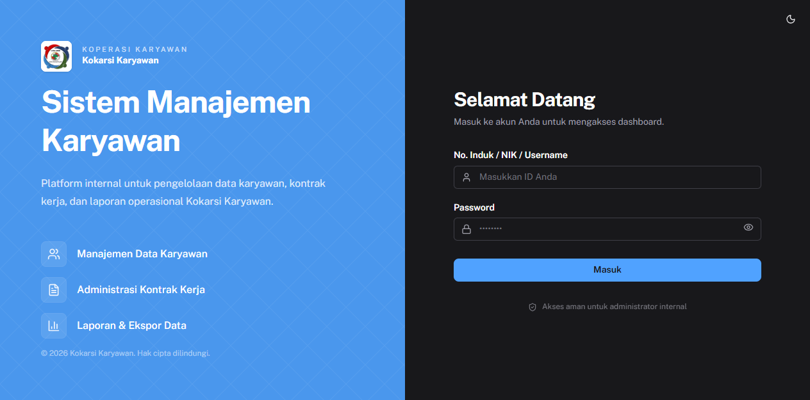

**Cara login:**
1. Isi kolom **No. Induk / NIK / Username** dengan nomor induk karyawan (contoh: `EMP001`)
2. Isi kolom **Password**
3. Klik tombol **Masuk**

**Catatan akses:**
| Peran | Akses |
|-------|-------|
| **Master Admin** | Semua fitur termasuk Master Data, Template Kontrak, dan User |
| **Pengelola Koperasi** | CRUD karyawan, kontrak, dokumen — tanpa akses Pengaturan |

> Gunakan tombol 👁 di samping kolom password untuk menampilkan/menyembunyikan password.

---

## 2. Dashboard

Setelah login berhasil, sistem menampilkan **Dashboard** sebagai halaman utama.

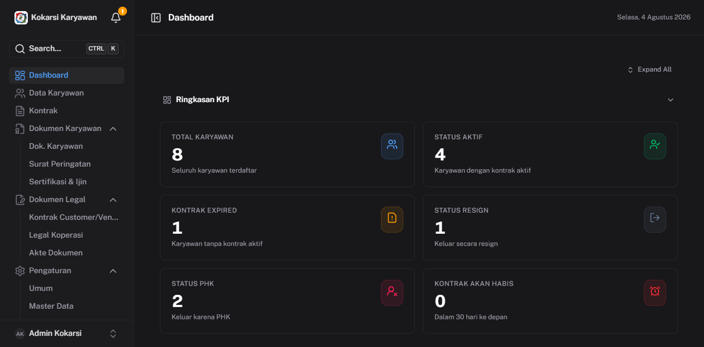

Dashboard berisi ringkasan lengkap data karyawan dalam beberapa panel:

- **Ringkasan KPI** — Total karyawan aktif, kontrak aktif, akan habis, dan expired
- **Distribusi & Status** — Grafik status kepegawaian (Aktif, Kontrak Habis, PHK, dll)
- **Demografi Karyawan** — Distribusi usia dan masa kerja
- **Distribusi Pendidikan & Departemen** — Komposisi SDM per bidang pendidikan
- **Trend Rekrutmen & Offboarding** — Grafik historis rekrutmen dan keluar karyawan
- **Akses Cepat** — Shortcut ke Data Karyawan, Kontrak, Master Data, Pengaturan

**Navigasi sidebar (kiri):**
- Dashboard
- Data Karyawan
- Kontrak
- Dokumen Karyawan (Dok. Karyawan, Surat Peringatan, Sertifikasi & Ijin)
- Dokumen Legal (Kontrak Customer/Vendor, Legal Koperasi, Akte Dokumen)
- Pengaturan (Umum, Master Data, Template Kontrak, User, Keamanan)

---

## 3. Data Karyawan

Halaman ini menampilkan **daftar seluruh karyawan** beserta status kepegawaiannya.

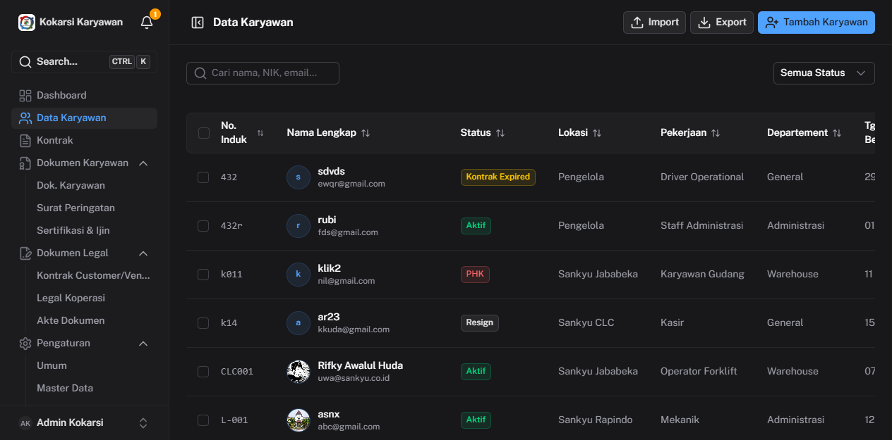

### Fitur utama

**Pencarian & Filter:**
- Ketik nama atau nomor karyawan di kolom pencarian
- Filter berdasarkan status, site/lokasi, departemen, atau jabatan
- Gunakan shortcut `CTRL+K` untuk pencarian global di seluruh sistem

**Tambah Karyawan Baru:**
1. Klik tombol **+ Tambah Karyawan**
2. Isi semua field wajib: No. Induk, Nama Lengkap, Tanggal Lahir, Jenis Kelamin, Tanggal Bergabung, Email, No. HP, dan Foto
3. Klik **Simpan**

**Import Bulk (Excel):**
1. Klik tombol **Import Excel**
2. Unduh template Excel yang tersedia
3. Isi data karyawan sesuai format template
4. Upload file Excel yang sudah diisi
5. Sistem akan memvalidasi dan mengimpor data secara massal

**Aksi per karyawan (tombol `⋯` di kolom Aksi):**
- Lihat Detail
- Edit Data
- Hapus Karyawan

**Kolom tabel:**
| Kolom | Keterangan |
|-------|------------|
| No. Karyawan | Nomor induk unik |
| Nama | Nama lengkap + email |
| Status | Aktif, Kontrak Habis, PHK, Resign, dll |
| Site/Lokasi | Lokasi kerja karyawan |
| Jabatan | Posisi/jabatan karyawan |
| Departemen | Bidang kerja |
| Bergabung | Tanggal mulai kerja |

---

## 4. Detail Karyawan

Klik nama karyawan di tabel untuk membuka halaman **Detail Karyawan**.

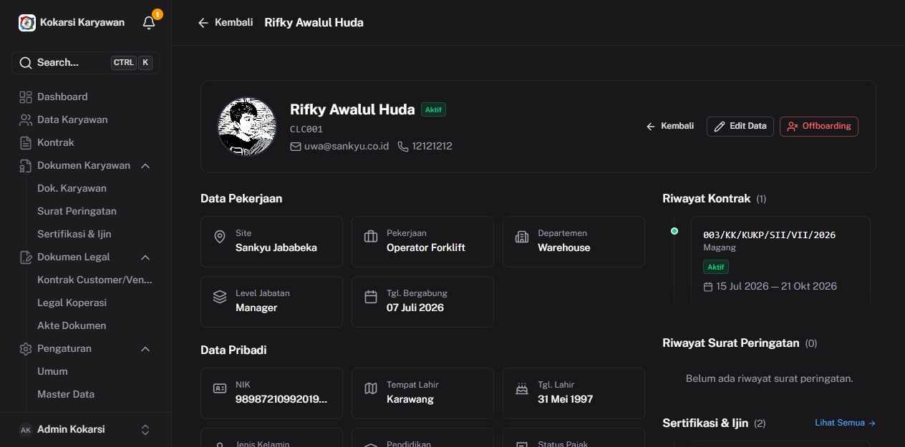

Halaman ini menampilkan informasi lengkap satu karyawan dalam beberapa section:

### Section yang tersedia

**Informasi Pekerjaan**
- Nomor karyawan, jabatan, departemen, site/lokasi, status kepegawaian, dan tanggal bergabung

**Informasi Pribadi**
- Nama lengkap, tanggal lahir, jenis kelamin, nomor HP, email, dan alamat

**Status Kerja**
- Status aktif/non-aktif dan catatan perubahan

**Riwayat Kontrak**
- Daftar semua kontrak yang pernah dibuat untuk karyawan ini (nomor kontrak, periode, status)

**Riwayat Surat Peringatan**
- SP yang pernah diterbitkan beserta tanggal dan tingkat SP (SP1/SP2/SP3)

**Sertifikasi & Ijin**
- Daftar sertifikasi dan ijin yang dimiliki, dengan tanggal berlaku dan status

### Tombol Aksi
- **Edit** — ubah data karyawan
- **Ubah Status** — update status kepegawaian (Aktif → Resign/PHK/dll)
- **Buat Kontrak** — langsung buat kontrak baru untuk karyawan ini
- **Tambah SP** — buat surat peringatan baru

---

## 5. Manajemen Kontrak

Menu **Kontrak** di sidebar menampilkan semua kontrak karyawan dalam satu tabel.

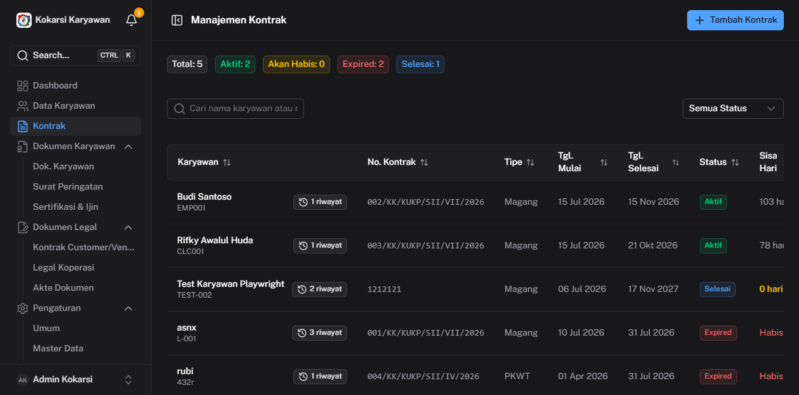

### Tampilan Summary Mode

Tabel menampilkan 1 baris per karyawan (kontrak terbaru/aktif). Klik **"N riwayat"** untuk melihat semua riwayat kontrak karyawan tersebut.

**Kolom tabel:**
| Kolom | Keterangan |
|-------|------------|
| Karyawan | Nama + tombol riwayat |
| Nomor Kontrak | Format: `{seq}/KK/KUKP/SII/{bulan_romawi}/{tahun}` |
| Tipe | PKWT atau Mitra |
| Mulai | Tanggal awal kontrak |
| Selesai | Tanggal akhir kontrak |
| Status | Aktif, Expired, Akan Habis |
| Indikator | Visual status (Habis, Aktif, dll) |

### Buat Kontrak Baru
1. Klik tombol **+ Buat Kontrak**
2. Pilih karyawan
3. Pilih **Tipe Kontrak** (PKWT atau Mitra)
4. Pilih **Template** yang sesuai (PKWT_DRIVER, PKWT_KASIR, MITRA_STAFF, dll)
5. Isi tanggal mulai dan selesai kontrak
6. Klik **Generate PDF** untuk membuat dokumen PDF otomatis
7. Klik **Simpan**

> Nomor kontrak di-generate otomatis oleh sistem saat tanggal diisi — preview nomor berubah real-time mengikuti tanggal yang dipilih.

### Perpanjang Kontrak (Renew)
1. Klik tombol `⋯` di baris kontrak yang akan diperpanjang
2. Pilih **Perpanjang**
3. Isi tanggal kontrak baru
4. Sistem otomatis membuat rantai renewal — kontrak lama tetap tersimpan sebagai riwayat

### Status Kontrak
| Status | Keterangan |
|--------|------------|
| **Aktif** | Kontrak masih berlaku |
| **Akan Habis** | Kontrak berakhir dalam 30 hari ke depan |
| **Expired** | Kontrak sudah berakhir |
| **Sudah Diperpanjang** | Kontrak lama yang sudah diperbarui |

---

## 6. Surat Peringatan (SP)

Menu **Surat Peringatan** di bawah Dokumen Karyawan menampilkan semua SP yang pernah diterbitkan.

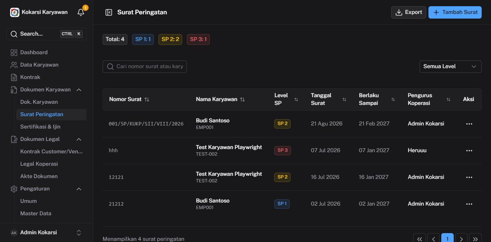

**Kolom tabel:**
| Kolom | Keterangan |
|-------|------------|
| Nomor SP | Format: `{seq}/SP/KUKP/SII/{bulan_romawi}/{tahun}` |
| Karyawan | Nama + nomor induk |
| Tingkat | SP 1, SP 2, atau SP 3 |
| Tanggal | Tanggal surat diterbitkan |
| Berlaku Sampai | Tanggal berakhir (otomatis: +6 bulan dari tanggal terbit) |
| Diproses Oleh | Nama pengurus koperasi |

### Buat Surat Peringatan Baru
1. Klik tombol **+ Buat SP**
2. Pilih **Karyawan** yang akan diberi SP
3. Pilih **Tingkat SP** (SP 1 / SP 2 / SP 3)
4. Isi **Jenis Pelanggaran** (bisa lebih dari satu)
5. Isi **Tanggal Surat** — nomor SP di-generate otomatis
6. (Opsional) Upload **file lampiran** — foto bukti atau dokumen pendukung
7. Klik **Simpan**

> SP yang aktif otomatis berakhir 6 bulan setelah tanggal terbit dan tidak perlu dihapus manual.

---

## 7. Dokumen Karyawan

Menu **Dok. Karyawan** menampilkan semua dokumen yang terkait dengan data pribadi karyawan.

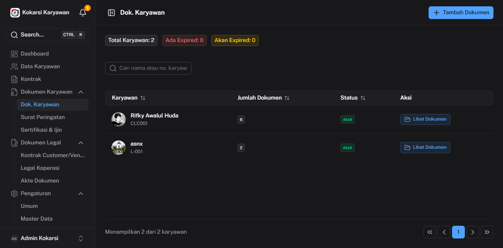

Halaman ini menampilkan daftar karyawan beserta jumlah dokumen yang telah diupload.

### Lihat Dokumen Karyawan
1. Klik tombol **Lihat Dokumen** di baris karyawan yang ingin dilihat
2. Drawer/panel akan terbuka menampilkan semua dokumen karyawan tersebut

### Jenis Dokumen yang Dikelola
- KTP, NPWP, Kartu Keluarga
- Ijazah terakhir
- Foto karyawan
- Dokumen lainnya sesuai Master Dokumen yang dikonfigurasi di Pengaturan

### Upload Dokumen
1. Klik **Lihat Dokumen** pada karyawan
2. Klik tombol **+ Upload**
3. Pilih jenis dokumen
4. Upload file (PDF/JPG/PNG, maks. 10MB)
5. Klik **Simpan**

---

## 8. Sertifikasi & Ijin

Menu **Sertifikasi & Ijin** menampilkan semua sertifikasi dan perizinan karyawan.

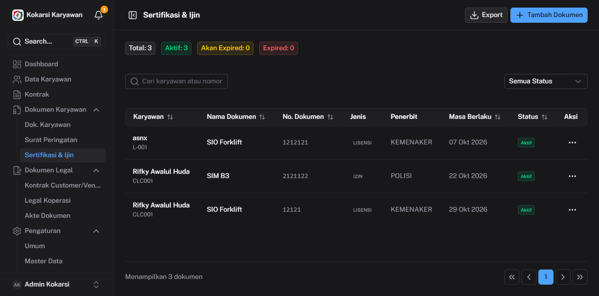

**Kolom tabel:**
| Kolom | Keterangan |
|-------|------------|
| Karyawan | Nama + nomor karyawan |
| Nama Dokumen | Nama sertifikasi/ijin (SIM B3, SIO Forklift, dll) |
| Nomor | Nomor dokumen |
| Jenis | LISENSI, IZIN, SERTIFIKAT |
| Penerbit | Instansi penerbit (POLISI, KEMENAKER, dll) |
| Berlaku Sampai | Tanggal kedaluwarsa |
| Status | Aktif / Akan Expired / Expired |

### Tambah Sertifikasi/Ijin
1. Klik tombol **+ Tambah**
2. Pilih karyawan
3. Isi nama sertifikasi, nomor, jenis, dan penerbit
4. Isi tanggal terbit dan tanggal berlaku sampai
5. (Opsional) Upload file dokumen
6. Klik **Simpan**

### Perpanjang Sertifikasi
1. Klik tombol `⋯` pada baris sertifikasi
2. Pilih **Perpanjang**
3. Isi tanggal berlaku baru
4. Klik **Simpan**

> Sistem otomatis mengirim notifikasi email 30 hari dan 7 hari sebelum sertifikasi/ijin habis.

---

## 9. Kontrak Customer/Vendor

Menu **Kontrak Customer/Vendor** di bawah Dokumen Legal mengelola kontrak dengan pihak ketiga (customer atau vendor).

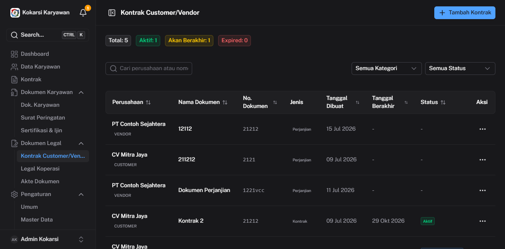

**Kolom tabel:**
| Kolom | Keterangan |
|-------|------------|
| Nama Pihak | Nama perusahaan + tipe (CUSTOMER/VENDOR) |
| Nama Kontrak | Judul/nama kontrak |
| Nomor | Nomor kontrak |
| Jenis | Kontrak, MOU, dll |
| Mulai | Tanggal awal |
| Selesai | Tanggal akhir |
| Status | Aktif, Akan Habis, Expired, Sudah Diperpanjang |

### Tambah Kontrak Vendor/Customer
1. Klik **+ Tambah Kontrak**
2. Isi nama pihak dan pilih tipe (Customer/Vendor)
3. Isi nama kontrak, nomor, dan jenis
4. Isi tanggal mulai dan selesai
5. (Opsional) Upload file kontrak yang sudah ditandatangani
6. Klik **Simpan**

---

## 10. Legal Koperasi

Menu **Legal Koperasi** mengelola dokumen legal internal koperasi (izin usaha, akta, SK, dll).

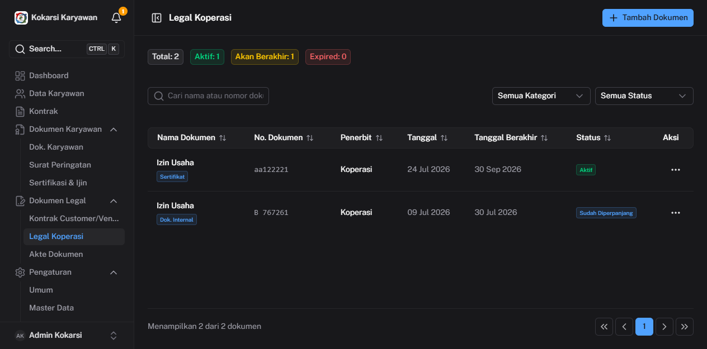

**Kolom tabel:**
| Kolom | Keterangan |
|-------|------------|
| Nama Dokumen | Nama jenis dokumen (Izin Usaha, dll) |
| Nomor | Nomor dokumen |
| Kategori | Koperasi, Internal, dll |
| Tanggal Terbit | Tanggal dokumen diterbitkan |
| Berlaku Sampai | Tanggal kedaluwarsa |
| Status | Aktif / Sudah Diperpanjang |

### Tambah Dokumen Legal
1. Klik **+ Tambah**
2. Pilih atau ketik nama dokumen
3. Isi nomor, kategori, dan periode berlaku
4. Upload file dokumen (PDF)
5. Klik **Simpan**

### Perpanjang Dokumen Legal
1. Klik `⋯` → **Perpanjang**
2. Kolom **Nama Dokumen** otomatis terkunci (tidak bisa diubah saat perpanjangan)
3. Isi tanggal berlaku baru dan nomor baru jika ada
4. Klik **Simpan**

---

## 11. Akte Dokumen

Menu **Akte Dokumen** menyimpan akte-akte resmi koperasi beserta informasi notaris.

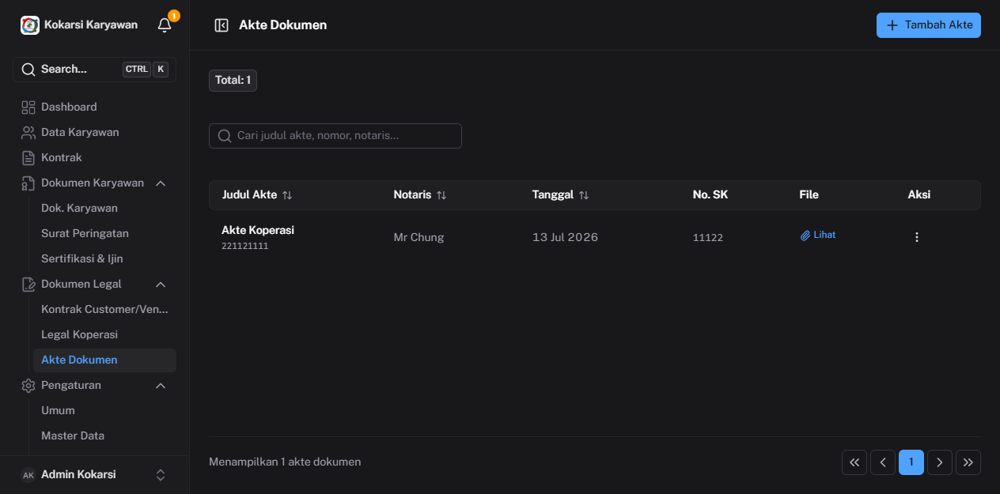

**Kolom tabel:**
| Kolom | Keterangan |
|-------|------------|
| Nomor Akte | Nomor akte notaris |
| Notaris | Nama notaris pembuat akte |
| Tanggal | Tanggal pembuatan akte |
| No. SK | Nomor SK Kemenkumham |
| File | Link untuk melihat file akte |

### Tambah Akte
1. Klik **+ Tambah Akte**
2. Isi nomor akte, nama notaris, tanggal
3. Isi nomor SK (jika ada)
4. Upload file akte (PDF)
5. Klik **Simpan**

---

## 12. Notifikasi

Ikon lonceng di pojok kanan atas sidebar menampilkan notifikasi yang belum dibaca. Angka merah menunjukkan jumlah notifikasi belum dibaca.

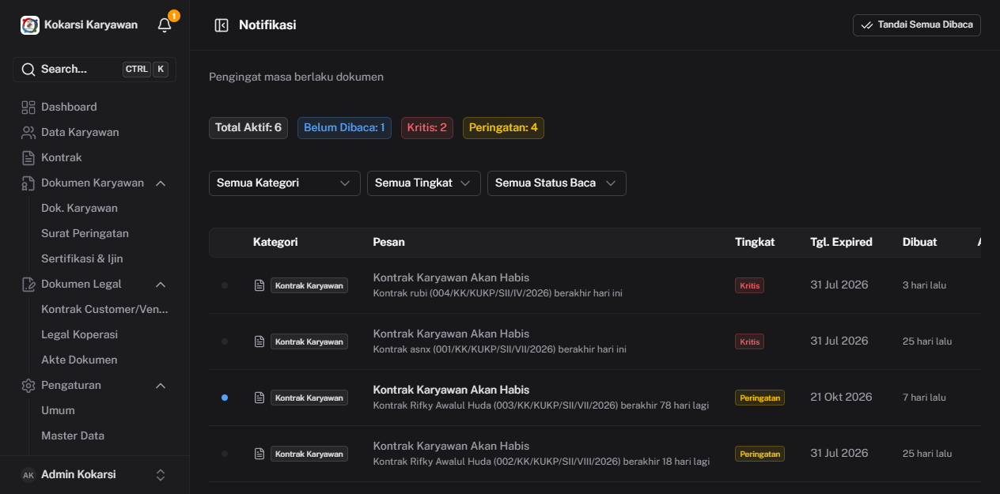

### Jenis Notifikasi
| Jenis | Keterangan |
|-------|------------|
| **Kontrak Karyawan Akan Habis** | Kontrak berakhir dalam 30 atau 7 hari ke depan |
| **Sertifikasi/Ijin Akan Expired** | Sertifikasi/ijin berakhir dalam 30 atau 7 hari ke depan |
| **Legal Koperasi Akan Habis** | Dokumen legal hampir kedaluwarsa |

### Cara Menggunakan Notifikasi
- Klik ikon lonceng untuk melihat ringkasan notifikasi terbaru (popover)
- Klik **Lihat Semua Notifikasi** untuk membuka halaman notifikasi lengkap
- Klik **Buka Dokumen** pada notifikasi untuk langsung menuju halaman terkait
- Notifikasi diperbarui otomatis setiap 5 menit (real-time via SSE)

> Notifikasi bersifat informasional — sistem tidak otomatis memperpanjang dokumen. Tindak lanjut (perpanjang/renew) dilakukan manual oleh pengelola.

---

## 13. Pengaturan Umum

Menu **Pengaturan → Umum** khusus untuk **Master Admin**.

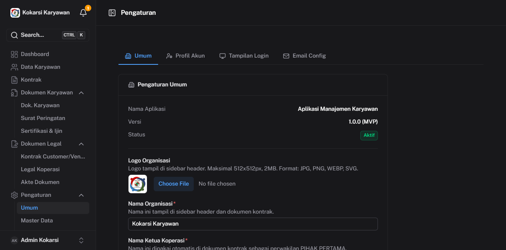

### Tab yang tersedia

**Tab Umum**
- **Logo Organisasi** — Upload logo untuk tampil di sidebar. Format: JPG/PNG/WEBP/SVG, maks. 2MB, 512×512px
- **Nama Organisasi** — Nama yang tampil di seluruh aplikasi (default: Kokarsi Karyawan)
- **Nama Ketua Koperasi** — Tampil di dokumen PDF yang digenerate
- Klik **Simpan Pengaturan** untuk menyimpan perubahan

**Tab Profil Akun**
- Ubah nama tampilan dan email akun yang sedang login

**Tab Tampilan Login**
- Kustomisasi tampilan halaman login (teks sambutan, background)

**Tab Email Config**
- Konfigurasi SMTP/Maileroo untuk pengiriman notifikasi email otomatis
- Isi API Key, From Email, dan From Name
- Klik **Kirim Email Uji** untuk memverifikasi konfigurasi

---

## 14. Master Data

Menu **Pengaturan → Master Data** untuk mengelola data referensi yang digunakan di seluruh sistem.

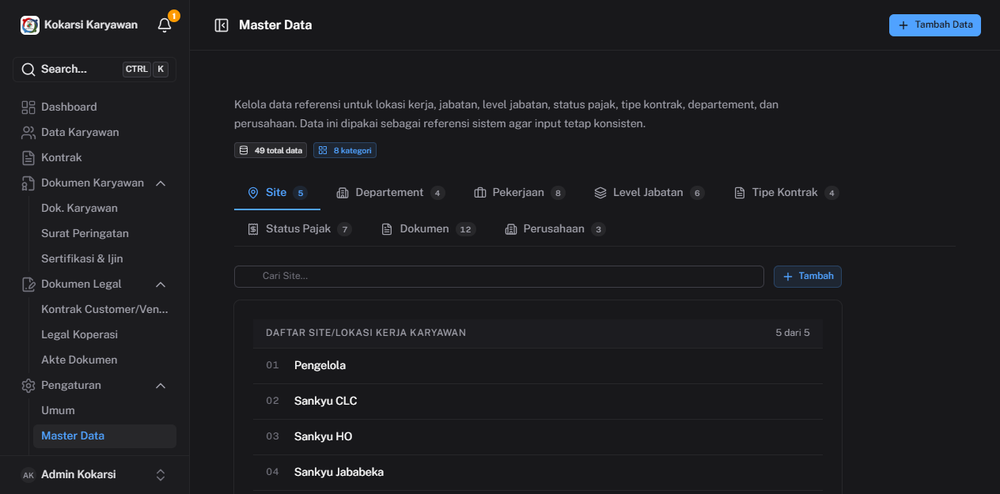

### Kategori Master Data

| Tab | Keterangan |
|-----|------------|
| **Site** | Daftar lokasi/site kerja karyawan |
| **Jabatan** | Daftar jabatan/posisi |
| **Departemen** | Daftar departemen/divisi |
| **Tipe Kontrak** | Jenis-jenis kontrak (PKWT, Mitra, dll) |
| **Status Pajak** | Daftar status pajak karyawan (TK0, K1, K2, dll) |
| **Dokumen** | Jenis dokumen untuk upload di Dok. Karyawan |
| **Perusahaan** | Daftar perusahaan principal/klien |

### Cara Menambah Data Master
1. Klik tab yang ingin dikelola (contoh: **Site**)
2. Klik tombol **Tambah**
3. Isi nama/nilai
4. Klik **Simpan**

### Edit / Hapus
- Klik ikon ✏️ (pensil) untuk edit
- Klik ikon 🗑️ (tempat sampah) untuk hapus
- Data master yang sedang digunakan tidak bisa dihapus

---

## 15. Template Kontrak

Menu **Pengaturan → Template Kontrak** mengelola template yang digunakan untuk generate PDF kontrak.

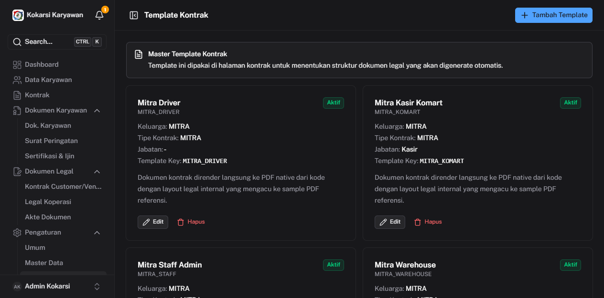

Tersedia template bawaan:
| Template Key | Tipe | Jabatan |
|-------------|------|---------|
| PKWT_DRIVER | PKWT | Driver |
| PKWT_KASIR | PKWT | Kasir |
| PKWT_STAFF | PKWT | Staff |
| PKWT_WAREHOUSE | PKWT | Karyawan Gudang |
| MITRA_DRIVER | Mitra | Driver |
| MITRA_KOMART | Mitra | Komart |
| MITRA_STAFF | Mitra | Staff |
| MITRA_WAREHOUSE | Mitra | Warehouse |

### Edit Template
1. Klik tombol **Edit** pada template yang ingin diubah
2. Sesuaikan isi pasal-pasal kontrak
3. Klik **Simpan**

> Template menggunakan variabel dinamis (`{nama_karyawan}`, `{tanggal_mulai}`, dll) yang otomatis diisi saat generate PDF.

---

## 16. Manajemen User

Menu **Pengaturan → User** khusus untuk **Master Admin** — mengelola akun pengguna sistem.

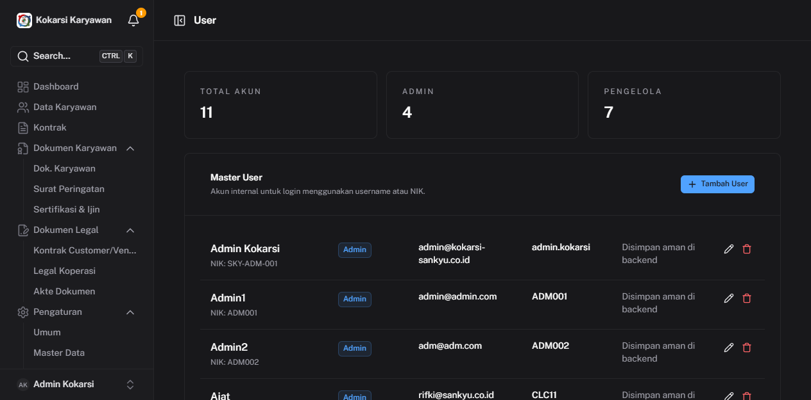

### Daftar User
Menampilkan semua akun yang terdaftar beserta peran (Master Admin / Pengelola Koperasi).

### Tambah User Baru
1. Klik tombol **+ Tambah User**
2. Isi NIK/username, nama lengkap, email
3. Pilih **Peran**: Master Admin atau Pengelola Koperasi
4. Isi password awal
5. Klik **Simpan**

### Peran & Akses
| Peran | Akses |
|-------|-------|
| **Master Admin** | Semua fitur termasuk Pengaturan, Master Data, Template, User |
| **Pengelola Koperasi** | Dashboard, Data Karyawan, Kontrak, Dokumen — tanpa Pengaturan |

### Edit / Nonaktifkan User
- Klik ikon ✏️ untuk edit data atau reset password
- Klik ikon 🔒 untuk nonaktifkan akun (user tidak bisa login)

---

## Tips & Shortcut

| Shortcut | Fungsi |
|----------|--------|
| `CTRL + K` | Pencarian global — cari karyawan, kontrak, SP dari mana saja |
| `F8` | Buka panel notifikasi |
| Klik nama karyawan | Buka halaman detail karyawan |
| Klik `N riwayat` di tabel Kontrak | Lihat semua riwayat kontrak karyawan |

---

## Catatan Penting

- **Backup data**: Sistem tidak menyediakan fitur backup otomatis dari UI. Hubungi administrator teknis untuk backup database secara berkala.
- **File upload**: Maksimal ukuran file 10MB per dokumen. Format yang didukung: PDF, JPG, PNG.
- **Hapus karyawan**: Menghapus data karyawan akan menghapus semua data terkait (kontrak, SP, dokumen). Tindakan ini **tidak dapat dibatalkan**.
- **Notifikasi email**: Pastikan konfigurasi email sudah diisi di Pengaturan > Umum > Email Config agar notifikasi email berjalan.

---

*Panduan ini dibuat dengan screenshot langsung dari sistem yang berjalan.*  
*Kontak developer: AnNahl Web Media*
